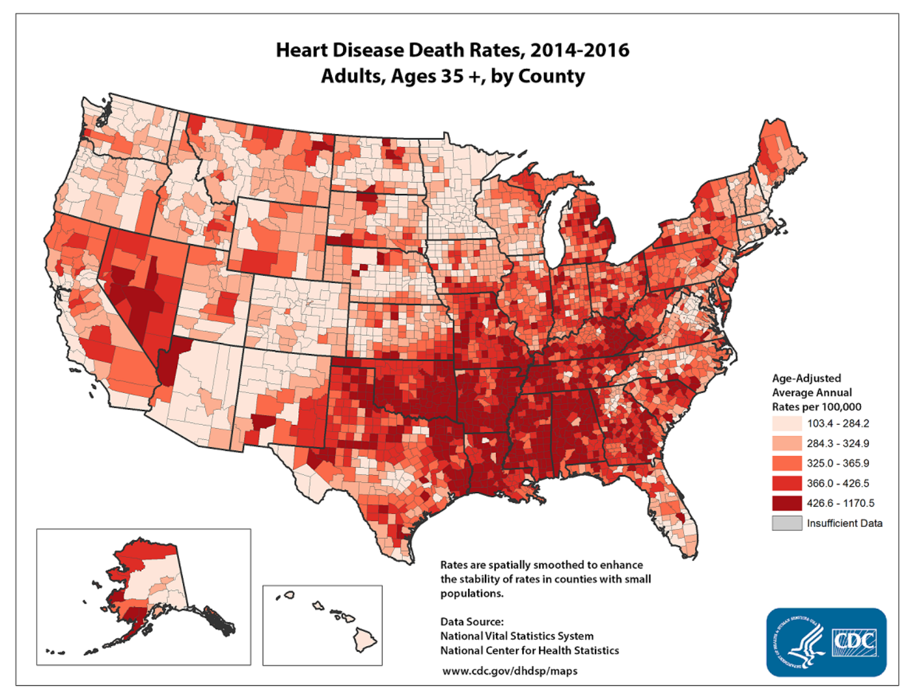
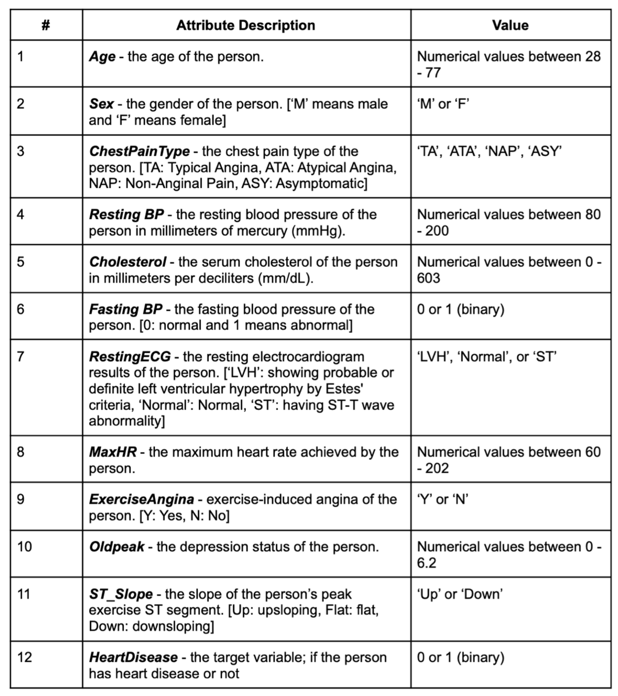

## Heart Failure Prediction Using Machine Learning

#### 1. OVERVIEW AND MOTIVATION

Heart disease is the leading cause of death for people of most racial and ethnic groups all around the world over the past few decades. According to the data from Centers for Disease Control and Prevention, More than 600,000 Americans die of heart disease each year - that is one in every four deaths in this country [CDC facts](https://www.cdc.gov/heartdisease/facts.htm). About one in five people who had experienced heart attacks were not aware of it when the damage was done. If more people among them can be conscious of and predict the potential risk of heart disease, they are more likely to get an early diagnosis and prompt management of the disease. Besides, from 2016 to 2017, the United States spent about 363 billion dollars on various kinds of costs due to heart disease [CDC facts](https://www.cdc.gov/heartdisease/facts.htm). We could have saved a large amount of money on the difficult laboratory tests and the subsequent healthcare services as well as lost productivity if we had predicted the heart disease cases.

This project aims to create a prediction model to forecast the probability of developing heart disease so as to help individuals be aware of their own health risk and to help doctors make reliable diagnosis more quickly.

The dataset is from UCI Machine Learning Repository, which is the largest heart disease dataset available so far for research purposes. We are going to process and analyze the complex medical data related to heart disease with the help of machine learning techniques including some supervised learning algorithms such as K-Nearest Neighbor, Decision Tree, Support Vector Machine, Random Forest, and Naïve Bayes.

#### 2. DESCRIPTION

The dataset we decided to use is the Heart Failure Prediction Dataset from University of California Irvine. This dataset was created by combining five independent dataset, which made it the largest heart disease dataset so far for research purposes. The dataset contains one csv file with 12 columns and 918 records, which contains 11 features of patients and 1 target variable. The target variable that describes the presence or absence of heart failure of patients is binary (0, 1) as follows.

Since this is a classification problem (presence or absence of heart failure), we will be training and tuning K-Nearest Neighbor, Decision Tree, Support Vector Ma- chine, Random Forest, and Naive Bayes models on the dataset, and try to find the best model for our problem.

We will be splitting 918 records into two portions: the training set and the testing set. We will use all of the data to train and test, but not at the same time. We will

1. Use cross validation techniques such as k-fold cross validation or monte-carlo cross validation to train the model using the training set and tune the hyperparameters;
2. Use the best hyperparameter value to train the model using the entire training dataset;
3. Evaluate the model (model assessment) using the test dataset and different evaluation metrics such as accuracy score and F-1 score;
4. Train the model using the best hyperparameter we found and the entire train and test dataset.

#### REFERENCE

There are totally 63 code submissions using our dataset on Kaggle. Most of them focused on data visualization and prediction model training. So far, the best model we could find on Kaggle is using the Random Forest model with a 90.2% accuracy score by SVEN ESCHLBECK.

There are also several works done by other researchers using another heart failure dataset from UCI which contains 303 records (which is included in this larger dataset). Since the dataset is too small, final models developed are likely to have low complexity, which will cause high bias towards the result.
